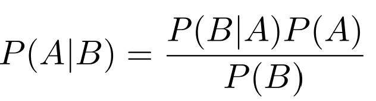
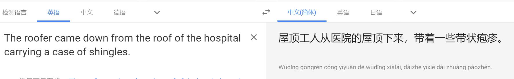

#2019年春季 北航《计算机科学前沿讲座》挑战作业


**16061079 柴林政**

---

>1. 在一个游戏中，主办方在三个门中任选一个，在门后放了一个奖品，另外两个门之后是空的。选手要在三个门中选择一个抽奖。 当选手选择了一个门，未曾打开门之前，主办方打开了另外两个门中没有奖品的那个门，并向选手说， 他可以改变他的选择，即转为选择剩下一个没有打开的门。 请问，如果选手此时改变选择， 他会提高或降低获奖的可能性么？提高多少？请给出你的分析。 

**解答**
* **如果换门的话， 他会提高获奖的可能性**
用极限法来看，假如门的数量增加到100个，选手选择一个门，主办方打开剩余99个中98个没有奖的门。如果不换门的话，获奖的概率是1/100，我们可以把剩余的99个门看做一个整体，那么获奖的概率就是99/100，因为主办方知道哪些门有奖，哪些没奖，因此剩余的那个门中有奖的概率和选手刚开始选的那个门有奖的概率并不相同。
* **我们也可以用贝叶斯公式来分析这个问题**

记x1，x2，x3分别表示在第1, 2, 3扇门之后有奖
那么起初P(x1) = P(x2) = P(x3) = 1/3
假设选手选择了门1。记主办方打开了门2为事件y，门2之后肯定是没有奖品的。那么就可以知道事件y发生的条件下，奖品在门1， 2， 3后面的条件概率是多少：
奖品在门1后面，那么主办方可以开门2和3，条件概率是1/2；
奖品在门2后面，那么主办方是不能打开门2的，则条件概率为0；
奖品在门3后面，那么主办方只能打开门2，条件概率就是1。
```
    P(y|x1) = 1/2
    P(y|x2) = 0
    P(y|x3) = 1
    P(y) = P(y|x1)P(x1)+P(y|x2)P(x2)+P(y|x3)P(x3)

    所以:
    P(x1|y) = P(y|x1)P(x1)/P(y) = 1/3
    P(x2|y) = P(y|x2)P(x2)/P(y) = 0
    P(x3|y) = P(y|x3)P(x3)/P(y) = 2/3
```
所以获奖概率会提升1/3

---

>2. 如何看待 “中文房间” 问题，中文房间有智能么？它有什么样水平的智能？如何才能让它具有人类水平的智能？ 参见 中文房间问题资料

**解答**
如今人们把人工智能分成了两个阶段，弱人工智能阶段和强人工智能阶段，现在大多人工智能研究的领域便是弱人工智能。
* 我认为中文房间有智能就是指的弱人工智能，而强人工智能指的拥有自己的意识的人工智能。弱人工智能只是单纯的在利用数据，利用数据做一些数学和统计学上的计算，这些数学计算给予它们一种能够学习的假象。

* 中文房间虽然能够回答问题，但是它并不懂其中真正的含义，它只是在操纵数据， 但是并不知道数据是什么意思。如果问题足够多， 中文房间总会有它回答不上来或者逻辑上不通的回答。
* 这种中文房间和如今的翻译程序其实有很多相似之处，例如Google翻译，必应翻译，这些翻译程序利用数据，将一种语言翻译成另一种语言，但是却经常有翻译不通顺的地方。如下图所示：
本应翻译成瓦片，程序却翻译成了带状疱疹。

这种现象产生的本质原因就是程序根本上并不理解它所做任务的实际内容含义。
* 如果让中文房间达到人类智能水平，只需要再给他配一本中英词典，让他在交流的同时去学习中文。理解任务的含义，而不是直接用程序去回答。


---
>3. 既然这门课讲了很多计算机前沿，那么学生就可以预计一下这些前沿知识如何能给普通用户或某个行业带来好处。 学生根据讲课的内容和参考文献，用 NABCD 的模板，描述你心目中一个使用了 “人工智能+其他前沿技术” 的创新项目。 这个项目应该是由 7 - 10 名有相关技能的大学生在 4 个月能完成。 
---
* **N (need)**
OCR技术可以快速地将印刷物上的文字输入到计算机中，方便之后的使用，然而如今大多的企业仍然在使用传统的OCR识别技术，先对文字进行切割，然后再对每个文字进行识别，然而文字的切割的精准程度会大大影响文字识别的准确率，经常出现文字部首被单独切割出来的情况。因此，如今的很多企业需要一个更高准确率的OCR识别工具。

* **A (Approach)**
随着人工智能的发展，如今OCR技术正在尝试使用人工智能的技术来提高识别的准确度。OCR可以分为两个步骤：
   1. **文本检测**
   我们首先需要检测出图片中的文本块（成段的文字则每行算作一个文本块），这需要用到图像处理的技术，我们的团队有过编写相关卷积神经网络的经验(faster-rcnn, yolo, ssd)。

   2. **文字识别**
    我们将使用端到端的不定长的文本识别技术，对长度不一的文字进行预测，需要用到crnn等相关模型。
   *  我们需要克服的困难是数据的收集以及标注问题，我们想通过人工生成数据的方法来解决一部分的数据问题。

* **B (Benefit)**
我们的工具可以提高OCR识别的准确率，同时我们的工具也支持输入数据继续进行训练，提高工具在不同场景下的准确率。

* **C (Competitors)**
我们的竞争对手有腾讯云，阿里云，百度云等相关云服务提供平台，它们都提供了相关OCR识别的接口。但是我们的优势在于可以继续训练，并且用户可以方便的更改模型的架构，对场景的应变能力更强。而这些平台仅仅提供了api接口，用户改进的空间较小。

* **D (Delivery, Data)**
我们准备将我们的产品封装为PC端的应用，在OCR相关的网址上进行广告的投放，同时打听联系需要大量使用OCR的公司企业（银行，金融企业）进行宣传。

